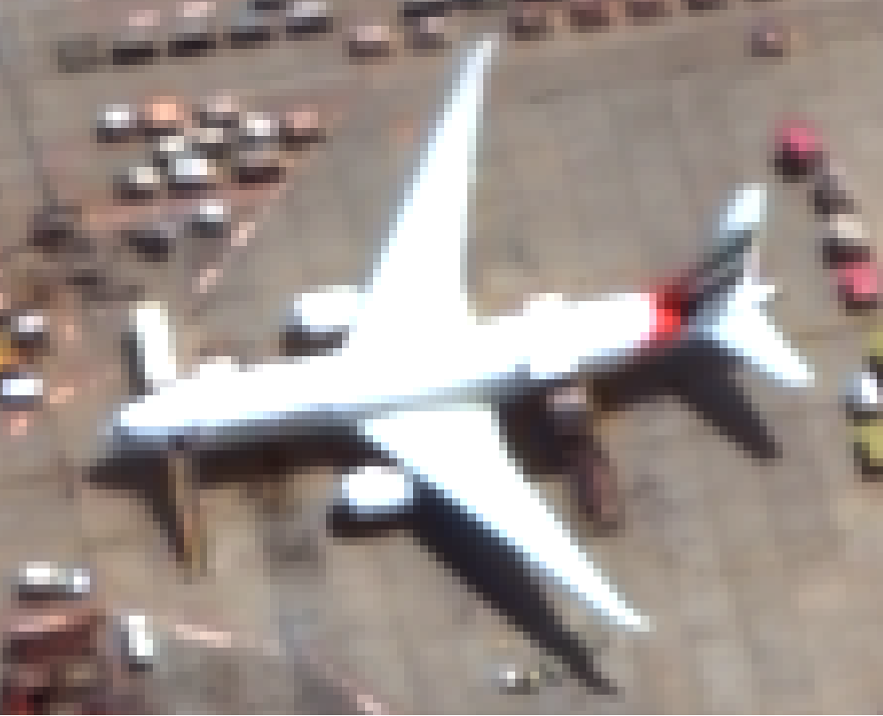

> Note: This project was a part of Machine Learning for Earth Observation (ML4EO) usecases designed for presenting to the participants of ESA SpaceApp Camp 2020 
## Product Summary 
This use case is an implememtation of a Random Forest Super Resolution. The method (adapted from [CosmiQ/RFSR](https://github.com/CosmiQ/RFSR)) is 
a random forest regressor with standard parameters. Google colab was used as the platform for implememtation. 

## Introduction

**Super-resolution imaging (SR)** is a class of techniques that enhance (increase) the resolution of an imaging system. 
The Super Resolution (SR) technology reconstructs an HR image with a single low resolution (LR) image or a sequence
of LR images.

We often hear the word **Enhance** in movies, when a cop goes through a highly zoomed in Image or CCTV footage in the process of hunting someone down. When the cop says **Enhance**, the image magically becomes super clear with the face being recognizable. Although the results showcased in the movies are no where near to real life, technically, this can be achieved using Super Resolution Imaging. 

Simply speaking, super resolution is the process of upscaling and or improving the details within an image using Machine Learning techniques. 

## Super Resolution approaches & methods

There are several approaches being used to achieve Super Resolution 

- Some approaches use single image 
- While others use multiple images from different viewing angles at different times 

The first approach uses high resolution images as training data, takes an input and then improves the resolution the image. 
The second approach uses multiple images of the same scene (temporal images & images from different viewing angles captured ind ifferent conditions) and then uses all the details from the temporal set of images to give out a higher resolution output image. 

Some of the commonly used methods are:  

- Random Forest Regressors
- Convolution Neural Networks (CNN)
- GAN (Generative adversarial network)

**This use case uses a single image approach with a Random Forest Regressor**

## Sample Pipeline for ML4EO

Pipeline required for performing a Super Resolution task is as follows. The task can be performed on both local and cloud platforms; cloud (**AWS or Ramani cloud** etc) can be used to store data, the images can be pulled from the cloud using the processing platform (a remote server like Google Colab or Python on a local computer). However, it is suggested to use Google Colab for runnning this script rather than a local machine. 

## Background Knowledge 

### Random Forest 

Random forests or random decision forests are an ensemble learning method for classification, regression and other tasks that operate by constructing a multitude of decision trees at training time and outputting the class that is the mode of the classes or mean prediction of the individual trees.

For more information on Random Forests and how they work, check the following resources: 

- https://towardsdatascience.com/understanding-random-forest-58381e0602d2
- https://medium.com/@williamkoehrsen/random-forest-simple-explanation-377895a60d2d
- https://www.stat.berkeley.edu/~breiman/RandomForests/cc_home.htm

### Regressor
A regressor is a model that performs regression analysis which consists of a set of machine learning methods that allow us to predict a continuous outcome variable (y) based on the value of one or multiple predictor variables (x).  The goal of a regression model is to build a mathematical equation that defines y as a function of the x variables.

## Random Forest Super Resolution 

### Dependencies 
Python 2.7+, GDAL, scikit-learn, scipy, numpy, opencv, and Jupyter Notebooks are the baseline requirements. 

#### Installation
To install the Dependencies use the following methods. In case, google colab is being used, `!pip install #insert package name`works well. In case of local implementation use the below mentioned methods. 

[How to install python packages?](https://packaging.python.org/tutorials/installing-packages/#:~:text=Ensure%20you%20can%20run%20pip%20from%20the%20command%20line,-Additionally%2C%20you'll&text=Run%20python%20get%2Dpip.py,they're%20not%20installed%20already.&text=Be%20cautious%20if%20you're,system%20or%20another%20package%20manager.)
- Use pip to install a package `pip install #insert package name`
- Use conda to install a package `conda install #insert package name`
- Downloading a python wheel (whl) and installing `pip install #file directory`

## Method Overview 

RFSR tries to upscale Low Resolution optical imagery by 2x or 3x. For this, higher resolution images are used as training data. 
The model works as follows: Training a RF regressor with very High Resolution (HR) imagery by downscaling (decreasing the resolution) them and predicting their upscaled version. Once the model is trained, we can give in any imagery as input. The model will upscale the images by 2x or 3x. 

Using imagery from the same area or scenes with similar land cover types will give better results. 

*Example 1: 60cm input image (top) vs 30cm output image (bottom) [Output from running the script on sample data]*

 

*Example 2: 60cm |Input image (top) vs 30cm output image (bottom) [Source: https://github.com/CosmiQ/RFSR]* 

 

*Example 3: 60cm Input image (top) vs 30cm output image (bottom) [Source: https://github.com/CosmiQ/RFSR]*

 

## Data Used  

Sample data: Sample Imagery from xView dataset [Sample Data](https://team.ujuizi.com:6443/manushibt/ml4eo/-/tree/master/UC4_Optical_SuperResolution/Sample%20Data)

Training Data: 1m UAV imagery 

Input: Sentinel-2 10m subset 

Expected Output: Sentinel-2 5m 

Downloading Sentinel 2 Imagery from Ramani Cloud using GetMosiac function: 
- [Tutorial](http://docs.ramani.ujuizi.com/#/basic/get-mosaic)
- [Knowledge Base - FAQ](https://helpdesk.ramani.ujuizi.com/help/en-us/1/57)

## How to use this script

This script can be used locally (any Python interpreter) or using Google Colab. For colab, the ipython notebook can be uploaded and customised accoring to your requirements or reproduced (each cell has comments). Sample data is also available with this repository. In case, the script is being used locally, make sure to install all the dependencies on a new environment and change the directories with the local paths. 

### System requirements
A stable internet conection with access to Google Chrome (preferably, or any other browser) will work.
